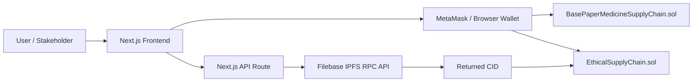
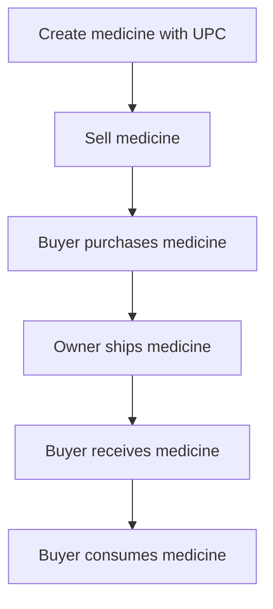
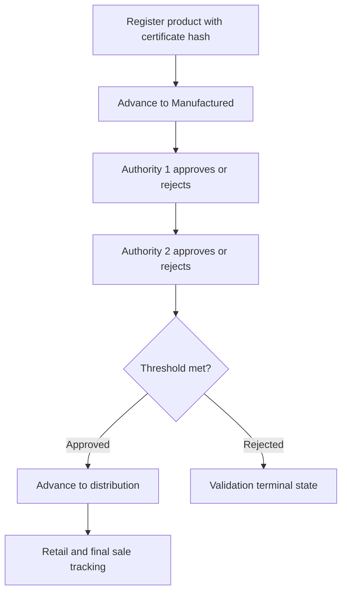
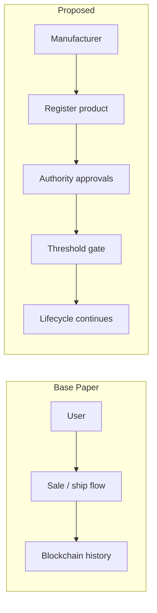
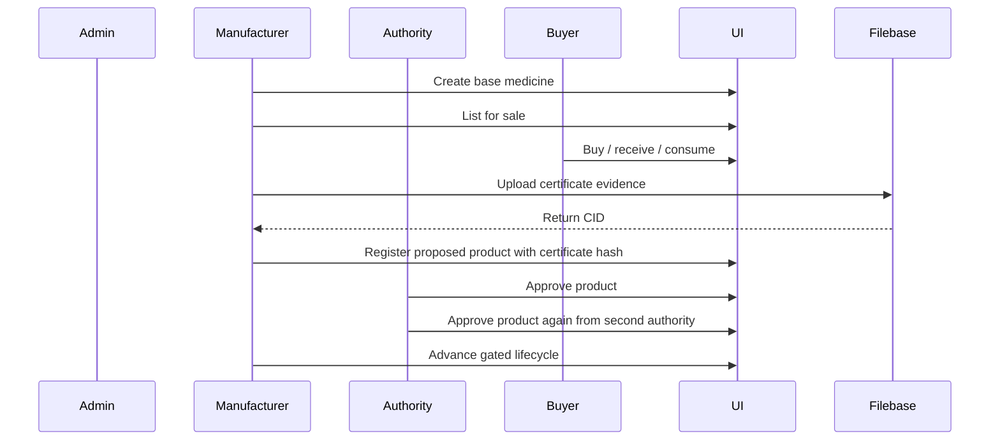

# Architecture and Workflow Diagrams

## System architecture

```mermaid
flowchart LR
    User[User / Stakeholder] --> Frontend[Next.js Frontend]
    Frontend --> Wallet[MetaMask / Browser Wallet]
    Frontend --> Api[Next.js API Route]
    Wallet --> Base[BasePaperMedicineSupplyChain.sol]
    Wallet --> Proposed[EthicalSupplyChain.sol]
    Api --> Filebase[Filebase IPFS RPC API]
    Filebase --> CID[Returned CID]
    CID --> Proposed
```

## Base paper workflow

```mermaid
flowchart TD
    A[Create medicine with UPC] --> B[Sell medicine]
    B --> C[Buyer purchases medicine]
    C --> D[Owner ships medicine]
    D --> E[Buyer receives medicine]
    E --> F[Buyer consumes medicine]
```

## Proposed workflow

```mermaid
flowchart TD
    A[Register product with certificate hash] --> B[Advance to Manufactured]
    B --> C[Authority 1 approves or rejects]
    C --> D[Authority 2 approves or rejects]
    D --> E{Threshold met?}
    E -- Approved --> F[Advance to distribution]
    E -- Rejected --> G[Validation terminal state]
    F --> H[Retail and final sale tracking]
```

## Base vs proposed trust model

```mermaid
flowchart LR
    subgraph Base Paper
        U1[User] --> B1[Sale / ship flow]
        B1 --> B2[Blockchain history]
    end

    subgraph Proposed
        U2[Manufacturer] --> P1[Register product]
        P1 --> P2[Authority approvals]
        P2 --> P3[Threshold gate]
        P3 --> P4[Lifecycle continues]
    end
```

## Demo sequence for panel

```mermaid
sequenceDiagram
    participant Admin
    participant Manufacturer
    participant Authority
    participant Buyer
    participant UI
    participant Filebase

    Manufacturer->>UI: Create base medicine
    Manufacturer->>UI: List for sale
    Buyer->>UI: Buy / receive / consume
    Manufacturer->>Filebase: Upload certificate evidence
    Filebase-->>Manufacturer: Return CID
    Manufacturer->>UI: Register proposed product with certificate hash
    Authority->>UI: Approve product
    Authority->>UI: Approve product again from second authority
    Manufacturer->>UI: Advance gated lifecycle
```
