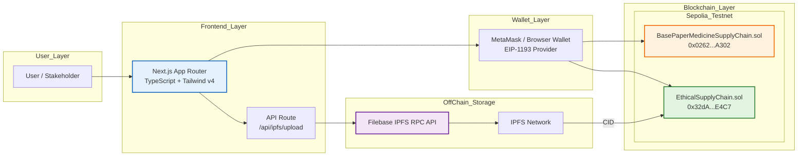

# Architecture Diagram

## Mermaid Code

## Text Description

**Layer 1 — User:** Stakeholders include Manufacturer, Distributor, Retailer, Authority, Admin, and Public Verifier.

**Layer 2 — Frontend:** Next.js 16 App Router with TypeScript and Tailwind CSS v4. Two main routes: `/` (landing + demo console) and `/verify` (public verification + QR).

**Layer 3 — Wallet:** MetaMask injects EIP-1193 provider. Frontend uses Ethers.js v6 to interact.

**Layer 4 — Blockchain:** Sepolia Testnet (Chain ID 11155111). Two deployed contracts:
- Baseline: `0x0262C4dEc9A16A5962e862926DD1AdA94c64A302`
- Proposed: `0x32dA54F4c606fccB17fcB3f41416529b181cE4C7`

**Layer 5 — Off-Chain Storage:** Filebase IPFS RPC API pins certificate evidence. Returned CID is hashed and stored in the proposed contract.
