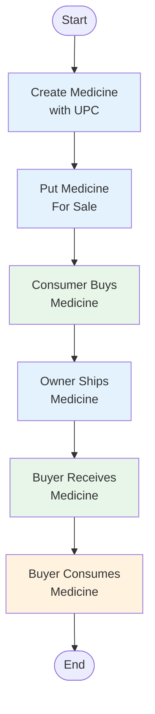

# Flow Diagram — Base Paper System

## Mermaid Code

## Flow Description

| Step | Actor | Action | Contract Function |
|------|-------|--------|-------------------|
| 1 | Manufacturer / Owner | Create medicine with UPC identifier | `createMedicine(upc, name, details)` |
| 2 | Owner | Set price and list for sale | `sellMedicine(upc, price)` |
| 3 | Registered Consumer | Send ETH to purchase | `buyMedicine(upc)` |
| 4 | Owner | Mark as shipped | `shipMedicine(upc)` |
| 5 | Buyer | Confirm receipt, ownership transfers | `receiveMedicine(upc)` |
| 6 | Buyer | Mark as consumed | `consumeMedicine(upc)` |

**Key Characteristic:** No external validation gate. Product flows directly from creation to consumption based on owner/consumer actions only.
