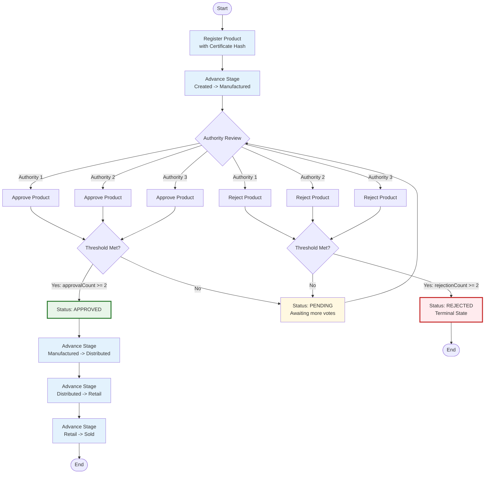

# Flow Diagram — Proposed System

## Mermaid Code

## Flow Description

| Step | Actor | Action | Contract Function |
|------|-------|--------|-------------------|
| 1 | Manufacturer | Register product with certificate hash, MFG/EXP dates | `registerProduct(...)` |
| 2 | Manufacturer | Move to manufacturing state | `advanceStage(productId, nextCustodian)` |
| 3 | Authority 1,2,3 | Review off-chain certificate, vote approve or reject | `approveProduct(productId)` / `rejectProduct(productId)` |
| 4 | Contract | Auto-check threshold after each vote | Internal logic |
| 5 | — | If approvals >= 2: status = Approved | — |
| 6 | — | If rejections >= 2: status = Rejected (terminal) | — |
| 7 | Manufacturer | Only if Approved: advance to Distributed | `advanceStage(productId, distributor)` |
| 8 | Distributor | Advance to Retail | `advanceStage(productId, retailer)` |
| 9 | Retailer | Advance to Sold | `advanceStage(productId, zeroAddress)` |

**Key Characteristic:** Mandatory validation gate at `Manufactured` stage. Product CANNOT progress to distribution without threshold approval (2-of-3).
