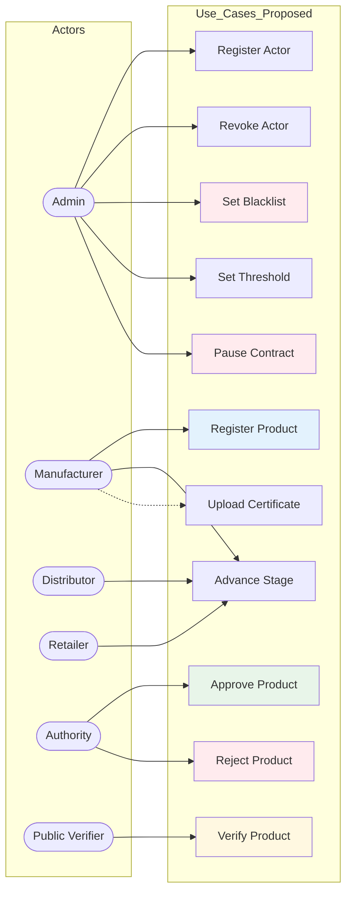

# Use Case Diagram

## Mermaid Code

## Use Case Descriptions

| Use Case | Primary Actor | Description |
|----------|--------------|-------------|
| **UC1: Register Product** | Manufacturer | Creates a new product on-chain with certificate hash, batch number, MFG/EXP dates |
| **UC2: Advance Stage** | Manufacturer / Distributor / Retailer | Moves product to next lifecycle stage if all guards pass |
| **UC3: Approve Product** | Authority | Records an approval vote for a product under validation |
| **UC4: Reject Product** | Authority | Records a rejection vote for a product under validation |
| **UC5: Register Actor** | Admin | Grants a role (Manufacturer, Distributor, Retailer, Authority) to an address |
| **UC6: Revoke Actor** | Admin | Removes a role from an address (with safety guards for authorities) |
| **UC7: Set Blacklist** | Admin | Instantly blocks/unblocks an actor from all interactions |
| **UC8: Set Threshold** | Admin | Updates the authority approval threshold (must be <= authority count) |
| **UC9: Pause Contract** | Admin | Emergency stop for all mutation functions |
| **UC10: Verify Product** | Public Verifier | Read-only lookup of product status, stage, approvals, certificate hash |
| **UC11: Upload Certificate** | Manufacturer | Uploads certificate evidence to IPFS via Filebase API |
