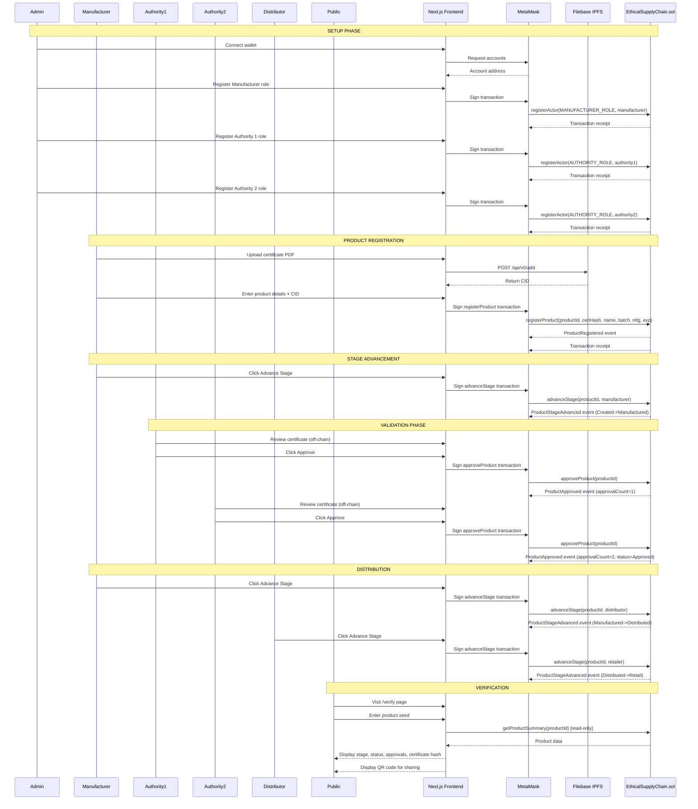

# Sequence Diagram

## Mermaid Code

## Key Sequences

1. **Admin Setup:** Registers all actors (Manufacturer, Authorities) before any product flow
2. **IPFS Upload:** Certificate evidence stored off-chain, CID referenced on-chain
3. **Validation Gate:** Two authority approvals required before distribution can begin
4. **Custodian Transfer:** Each stage advance can transfer custody to the next-role actor
5. **Public Verification:** Completely read-only, no wallet required for queries
