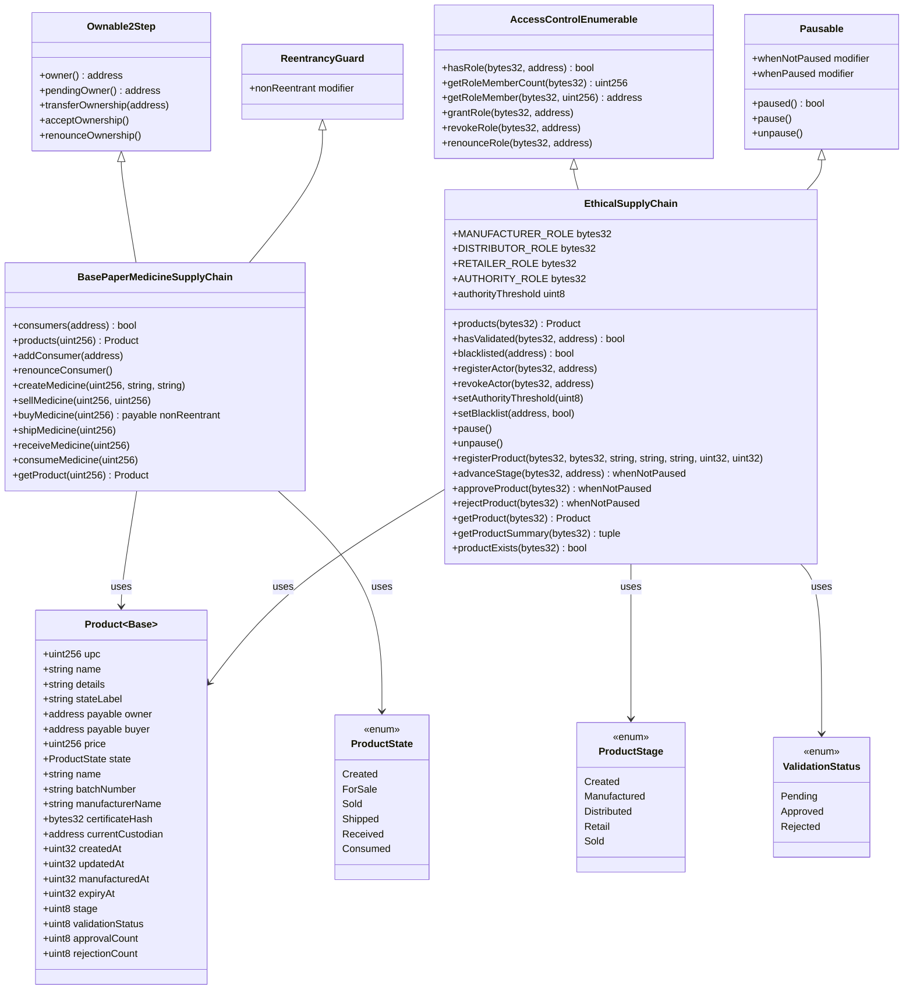

# Class Diagram

## Mermaid Code

## Class Descriptions

### BasePaperMedicineSupplyChain
- **Inherits:** Ownable2Step, ReentrancyGuard
- **Purpose:** Mirrors the base paper workflow for comparison
- **Key Storage:** `mapping(uint256 => Product) products`, `mapping(address => bool) consumers`
- **Security:** ReentrancyGuard on `buyMedicine()`, Ownable2Step for admin

### EthicalSupplyChain
- **Inherits:** AccessControlEnumerable, Pausable
- **Purpose:** Proposed system with threshold validation and governance
- **Key Storage:** `mapping(bytes32 => Product) products`, `mapping(bytes32 => mapping(address => bool)) hasValidated`, `mapping(address => bool) blacklisted`
- **Security:** RBAC, blacklist, pause, zero-address guards, threshold safety

### Product (Base)
- Uses uint256 UPC identifier
- String-based state labels
- Direct ETH transfers with refund logic

### Product (Proposed)
- Uses bytes32 compact identifier
- Packed fields: uint8 enums, uint32 timestamps
- Certificate hash anchoring for IPFS evidence
- Validation counters for threshold logic
