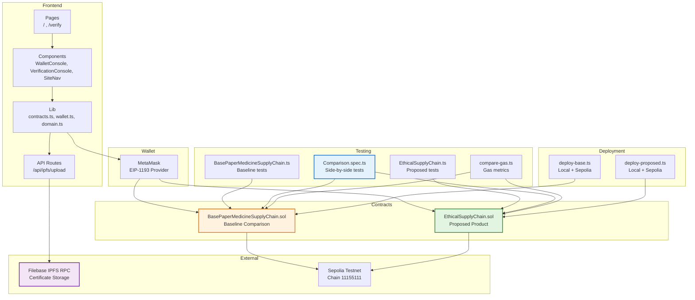

# Component Diagram

## Mermaid Code

## Component Descriptions

| Component | Type | Responsibility |
|-----------|------|----------------|
| **Pages** | Next.js App Router | Route handling for `/` (landing + demo) and `/verify` (public lookup) |
| **Components** | React Components | WalletConsole (live interaction), VerificationConsole (QR + lookup), SiteNav (navigation) |
| **Lib** | TypeScript Modules | Contract ABIs/config, wallet utilities, domain types/stage definitions |
| **API Routes** | Next.js API | Filebase IPFS upload proxy (`/api/ipfs/upload`) |
| **MetaMask** | Browser Extension | Wallet connection, transaction signing, network switching |
| **Base Contract** | Solidity | Baseline system for research comparison |
| **Proposed Contract** | Solidity | Main product with threshold validation |
| **Test Suites** | Hardhat + Chai | Feature tests, security tests, comparison tests, gas benchmarks |
| **Deploy Scripts** | Hardhat Scripts | Local deployment and Sepolia testnet deployment |
| **Filebase** | External API | IPFS pinning for certificate evidence |
| **Sepolia** | External Network | Ethereum testnet for live demos |
