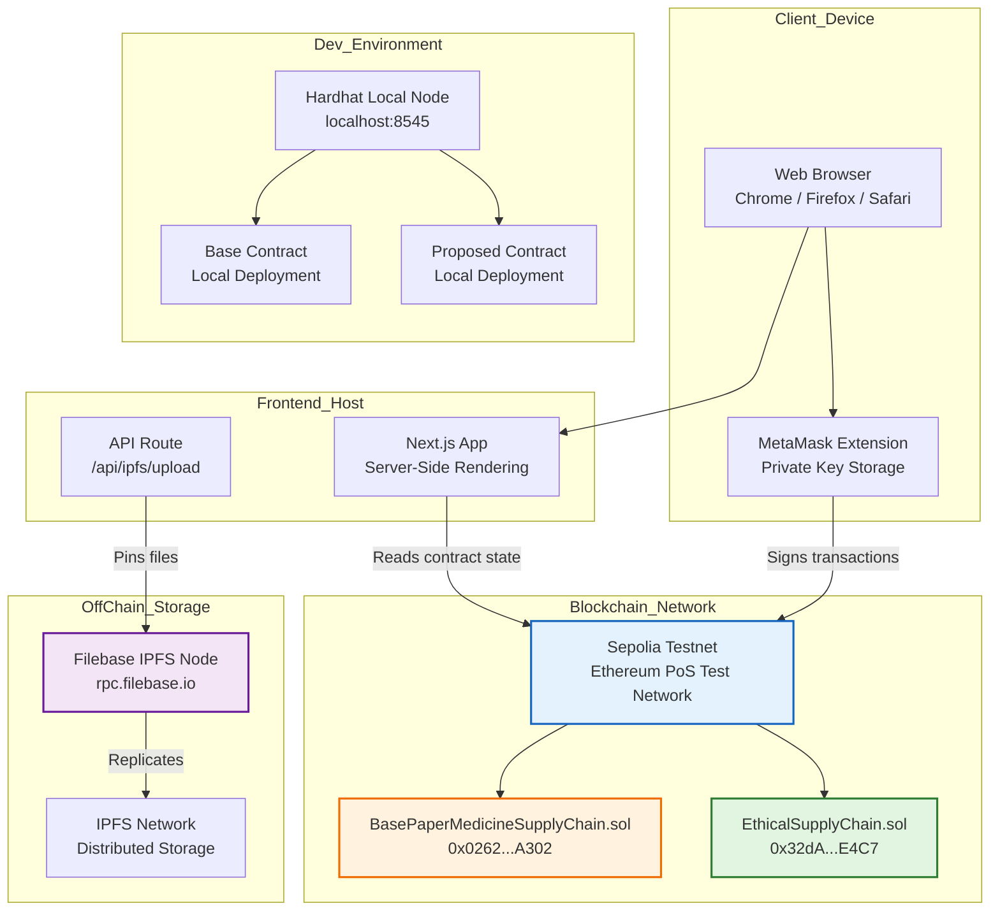

# Deployment Diagram

## Mermaid Code



## Deployment Details

### Production / Testnet Deployment

| Component | Location | Address / URL |
|-----------|----------|---------------|
| Next.js Frontend | Local development | `http://localhost:3000` |
| Base Contract | Sepolia | `0x0262C4dEc9A16A5962e862926DD1AdA94c64A302` |
| Proposed Contract | Sepolia | `0x32dA54F4c606fccB17fcB3f41416529b181cE4C7` |
| Filebase API | External | `https://rpc.filebase.io/api/v0/add` |

### Local Development Deployment

| Component | Command | Network |
|-----------|---------|---------|
| Hardhat Node | `bunx hardhat node` | `http://localhost:8545` |
| Deploy Base | `bun run deploy:base:localhost` | Local |
| Deploy Proposed | `bun run deploy:proposed:localhost` | Local |
| Run Frontend | `bun run dev:web` | `http://localhost:3000` |

### Network Configuration

```
Chain ID: 11155111
Chain Name: Sepolia
Currency: SepoliaETH (test ETH)
RPC: https://ethereum-sepolia-rpc.publicnode.com
```

**Note:** MetaMask displays "ETH" but on Sepolia this is test ETH, not mainnet ETH.
