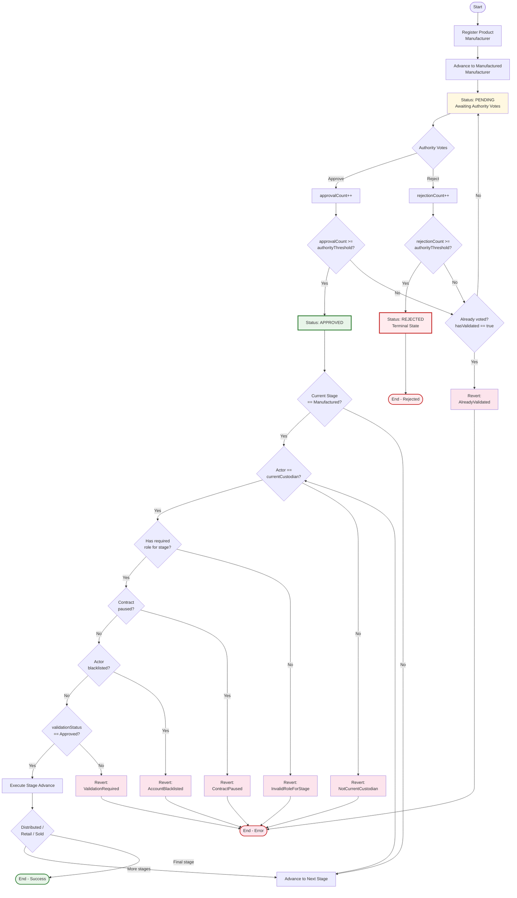

# Algorithm Flowchart

## Mermaid Code



## Algorithm Pseudocode

```solidity
// Threshold-Based Multi-Authority Ethical Validation Algorithm

function registerProduct(productId, certificateHash, metadata):
    require(msg.sender has MANUFACTURER_ROLE)
    require(product does not exist)
    store Product struct with stage = Created
    emit ProductRegistered

function advanceStage(productId, nextCustodian):
    require(contract not paused)
    require(msg.sender not blacklisted)
    
    product = getProduct(productId)
    currentStage = product.stage
    
    require(msg.sender has role for currentStage)
    require(msg.sender == product.currentCustodian)
    
    if currentStage == Manufactured:
        require(product.validationStatus == Approved)
    
    nextStage = currentStage + 1
    if nextCustodian != address(0):
        require(nextCustodian has role for nextStage)
    
    product.stage = nextStage
    product.currentCustodian = nextCustodian
    emit ProductStageAdvanced

function approveProduct(productId):
    require(contract not paused)
    require(msg.sender has AUTHORITY_ROLE)
    require(msg.sender not blacklisted)
    
    product = getProduct(productId)
    require(product.validationStatus == Pending)
    require(!hasValidated[productId][msg.sender])
    
    hasValidated[productId][msg.sender] = true
    product.approvalCount++
    
    if product.approvalCount >= authorityThreshold:
        product.validationStatus = Approved
    
    emit ProductApproved

function rejectProduct(productId):
    require(contract not paused)
    require(msg.sender has AUTHORITY_ROLE)
    require(msg.sender not blacklisted)
    
    product = getProduct(productId)
    require(product.validationStatus == Pending)
    require(!hasValidated[productId][msg.sender])
    
    hasValidated[productId][msg.sender] = true
    product.rejectionCount++
    
    if product.rejectionCount >= authorityThreshold:
        product.validationStatus = Rejected
    
    emit ProductRejected
```

## Guard Conditions Summary

| Guard | Where Enforced | Failure Result |
|-------|---------------|----------------|
| Not paused | `whenNotPaused` modifier | `ContractPaused` revert |
| Not blacklisted | `onlyActiveRole` modifier | `AccountBlacklisted` revert |
| Correct role | `hasRole` check | `InvalidRoleForStage` revert |
| Current custodian | `currentCustodian` comparison | `NotCurrentCustodian` revert |
| Validation passed | `validationStatus` check at Manufactured stage | `ValidationRequired` revert |
| Valid next custodian | `hasRole` check on nextCustodian | `InvalidNextCustodian` revert |
| No duplicate votes | `hasValidated` mapping | `AlreadyValidated` revert |
| Validation still open | `validationStatus == Pending` check | `ValidationClosed` revert |
