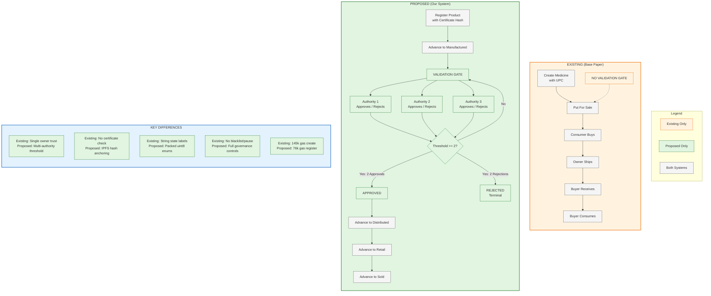

# Existing vs Proposed Comparison Flow

## Mermaid Code



## Side-by-Side Comparison

| Aspect | Existing (Base Paper) | Proposed (Our System) |
|--------|----------------------|----------------------|
| **Identifier** | UPC (uint256) | bytes32 compact hash |
| **Creation** | `createMedicine()` | `registerProduct()` + certificateHash |
| **Validation Gate** | ❌ None | ✅ Mandatory at Manufactured stage |
| **Validators** | None | 3 Authorities (2-of-3 threshold) |
| **Certificate** | ❌ Not tracked | ✅ IPFS CID hash anchored on-chain |
| **Dates** | ❌ Not tracked | ✅ MFG date + EXP date (uint32) |
| **Custody** | Owner/Buyer | Current custodian with role checks |
| **Governance** | Simple owner | RBAC + blacklist + pause + revocation safety |
| **Storage** | Strings + uint256 | Packed struct (uint8, uint32) |
| **Gas (create)** | 145,056 | 76,085 |
| **States** | Created → ForSale → Sold → Shipped → Received → Consumed | Created → Manufactured → Distributed → Retail → Sold |
| **Trust Model** | Implicit (owner says it's OK) | Explicit (authorities must approve) |

## Visual Summary

```
EXISTING:  Create -> Sell -> Buy -> Ship -> Receive -> Consume
            (No gate — flows freely)

PROPOSED:  Register -> Manufactured -> [VALIDATION GATE]
                                          |
                              +-----------+-----------+
                              |                       |
                         Approved (2/3)          Rejected (2/3)
                              |                       |
                              v                       v
                    Distributed -> Retail        (Terminal)
                              |
                              v
                            Sold
```
